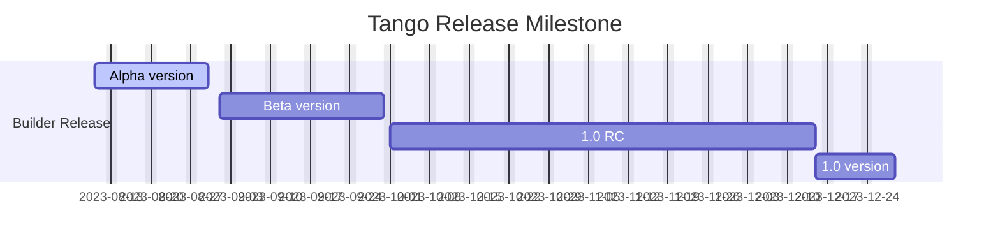

<p align="center">
  
</p>

<h1 align="center">Tango LowCode Builder</h1>
<div align="center">

A source code based low-code builder.

[](https://github.com/NetEase/tango/blob/main/LICENSE)
[](http://npmjs.org/package/@music163/tango-designer)


</div>

English | [简体中文](/README.zh-CN.md)

## 📄 Documentation

You can view the detailed usage guide through the following links:

- Document site: <https://netease.github.io/tango/>
- Playground application: <https://tango-demo.musicfe.com/designer/>

## ✨ Features

- Tested in the production environment of NetEase Cloud Music, can be flexibly integrated into low-code platforms, local development tools, etc.
- Based on source code AST, with no private DSL and protocol
  Real-time code generation capability, supporting source code in and source code out
- Out-of-the-box front-end low-code designer, providing flexible and easy-to-use designer React components
- Developed using TypeScript, providing complete type definition files

## 🌐 Compatibility

- Modern browsers（Chrome >= 80, Edge >= 80, last 2 safari versions, last 2 firefox versions）

## 🎯 Milestone



## 💻 Development

### Environment

- Node `>= 18`
- Yarn `>= 1.22 && < 2`

### Development Quick Start

```bash
# clone the repo
git clone https://github.com/NetEase/tango.git

# enter the project root
cd tango

# install dependencies
yarn

# start the designer playground app
yarn start
```

## 💬 Community

Join NetEase Tango Community to share your ideas, suggestions, or questions and connect with other users and contributors.

- Discord: <https://discord.gg/B6hkGTe4Rz>
- [Usage Trends](https://npm-compare.com/@music163/tango-helpers,@music163/tango-context,@music163/tango-core,@music163/tango-setting-form,@music163/tango-sandbox,@music163/tango-ui,@music163/tango-designer)

## 🤝 Contributing

Please read the [github contribution guide](https://docs.github.com/en/get-started/quickstart/contributing-to-projects) first。

- Clone the repository
- Create a branch
- Commit and push your code
- Open a Pull Request

## 💗 Acknowledgments

Thanks to the NetEase Cloud Music Front-end team, Public Technology team, Live Broadcasting Technology team, and all the developers who participated in the Tango project.

Thank you to CodeSandbox for providing the [Sandpack](https://sandpack.codesandbox.io/) project, which provides powerful online code execution capabilities for Tango.

## 📣 Product Promotion


Don't waste your time restoring the UI, try the NetEase Cloud Music "Seal D2C" development tool! Easily turn your design into code, support React, RN, Vue, WeChat apps and other multi-end scenarios, what you see is what you get!

Experience "Seal D2C" now:

- I'm a Figma user: <https://www.figma.com/community/plugin/1174548852019950797/seal-figma-to-code-d2c/>
- I'm a MasterGo user: <https://mastergo.com/community/plugin/98956774428196/>

## 📄 License

This project is licensed under the terms of the [MIT license](./LICENSE)
