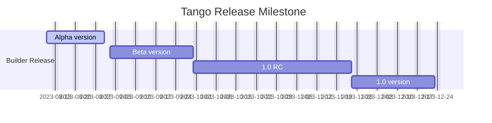

<p align="center">
  
</p>

<h1 align="center">Tango LowCode Builder</h1>
<div align="center">

A source code based low-code builder, developed by NetEase Cloud Music Develop Team.

[](https://github.com/NetEase/tango/blob/main/LICENSE)
[](http://npmjs.org/package/@music163/tango-designer)


</div>

English | [简体中文](/README.zh-CN.md)

## 📄 Documentation

You can view the detailed usage guide through the following links:

- Document site: <https://netease.github.io/tango/>
- Playground application: <https://tango-demo.musicfe.com/designer/>

## ✨ Features

- Tested in the production environment of NetEase Cloud Music, can be flexibly integrated into low-code platforms, local development tools, etc.
- Based on source code AST, with no private DSL and protocol
  Real-time code generation capability, supporting source code in and source code out
- Out-of-the-box front-end low-code designer, providing flexible and easy-to-use designer React components
- Developed using TypeScript, providing complete type definition files

## 🌐 Compatibility

- Modern browsers（Chrome >= 80, Edge >= 80, last 2 safari versions, last 2 firefox versions）

## 🎯 Milestone



## 💻 Development

### Recommended Development Environment

- Node.js >= 16.0.0
- Yarn >= 1.22.0

### Development Quick Start

```bash
# clone the repo
git clone https://github.com/NetEase/tango.git

# enter the project root
cd tango

# install dependencies
yarn

# start the designer playground app
yarn start
```

## 💬 Community

Join NetEase Tango Community to share your ideas, suggestions, or questions and connect with other users and contributors.

- Discord: <https://discord.gg/B6hkGTe4Rz>

## 🤝 Contributing

Please read the [github contribution guide](https://docs.github.com/en/get-started/quickstart/contributing-to-projects) first。

- Clone the repository
- Create a branch
- Commit and push your code
- Open a Pull Request

## 📈 Usage Trends

[Usage Trends of Tango Packages](https://npm-compare.com/@music163/tango-helpers,@music163/tango-context,@music163/tango-core,@music163/tango-setting-form,@music163/tango-sandbox,@music163/tango-ui,@music163/tango-designer)

## 💗 Acknowledgments

Thanks to the NetEase Cloud Music Front-end team, Public Technology team, Live Broadcasting Technology team, and all the colleagues who participated in the Tango project.

Thank you to CodeSandbox for providing the [Sandpack](https://sandpack.codesandbox.io/) project, which provides powerful online code execution capabilities for Tango.

## 📄 License

This project is licensed under the terms of the [MIT license](./LICENSE)
