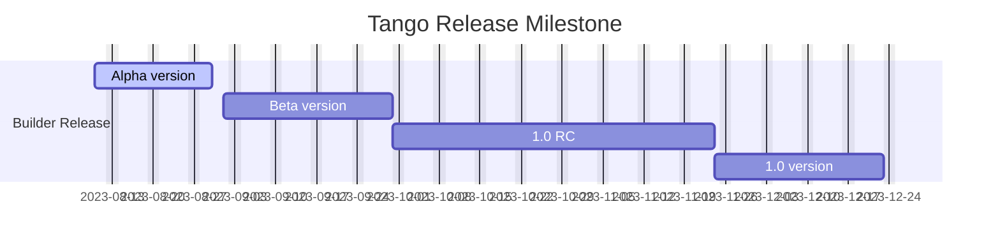

<p align="center">
  
</p>

<h1 align="center">Tango 低代码设计器</h1>
<div align="center">

一个源码驱动的低代码设计器，来自网易云音乐技术团队

[](https://github.com/NetEase/tango/blob/main/LICENSE)
[](http://npmjs.org/package/@music163/tango-designer)


</div>

简体中文 | [English](/README.md)

## 📄 文档

可以通过下面的链接查看详细的使用指南：

- 官方文档站点: <https://netease.github.io/tango/>
- 演示应用: <https://tango-demo.musicfe.com/designer/>

## ✨ 特性

- 经历网易云音乐内网生产环境的实际检验，可灵活集成应用于低代码平台，本地开发工具等
- 基于源码 AST 驱动，无私有 DSL 和协议
- 提供实时出码能力，支持源码进，源码出
- 开箱即用的前端低代码设计器，提供灵活易用的设计器 React 组件
- 使用 TypeScript 开发，提供完整的类型定义文件

## 🌐 兼容环境

- 现代浏览器（Chrome >= 80, Edge >= 80, last 2 safari versions, last 2 firefox versions）

## 🎯 里程碑



## 📄 如何使用

安装设计器

```bash
npm install @music163/tango-designer
```

初始化设计器内核

```js
import { createEngine } form '@music163/tango-designer';

// 引擎初始化
const engine = createEngine({
  entry: '/src/index.js',
  files: sampleFiles,
  componentPrototypes: prototypes as any,
});
```

初始化拖拽引擎

```js
import { DndQuery } form '@music163/tango-designer';

const sandboxQuery = new DndQuery({
  context: 'iframe',
});
```

设计器框架初始化(WIP)

详细使用方法请参考 [使用文档](https://netease.github.io/tango/)。

## 💻 开发

### 推荐开发环境

- Node.js >= 16.0.0
- Yarn >= 1.22.0

### 本地开发调试方法

```bash
# 下载仓库
git clone https://github.com/NetEase/tango.git

# 进入项目根目录
cd tango

# 安装依赖
yarn

# 启动设计器示例
yarn start
```

## 🤝 参与共建

请先阅读 [贡献指南](https://docs.github.com/en/get-started/quickstart/contributing-to-projects)。

- 克隆仓库
- 创建分支
- 提交代码
- 合并修改 git rebase master
- 发起 Pull Request

## 💗 致谢

感谢网易云音乐公共技术团队，大前端团队，直播技术团队，以及所有参与过 Tango 项目的同学们。

感谢 CodeSandbox 提供的 [Sandpack](https://sandpack.codesandbox.io/) 项目，为 Tango 提供了强大的基于浏览器的代码构建与执行能力。
