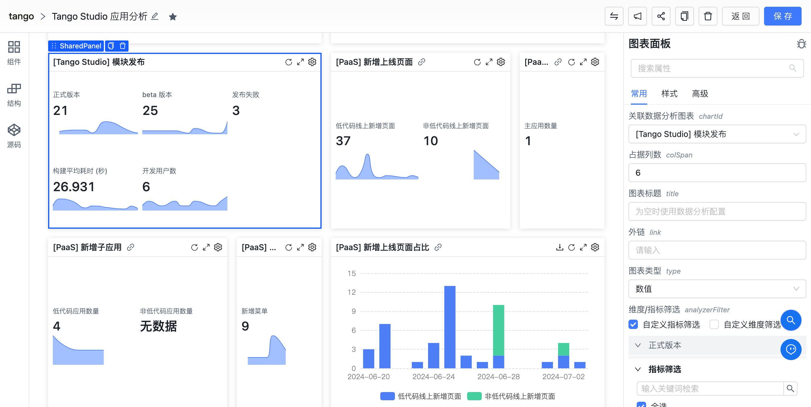
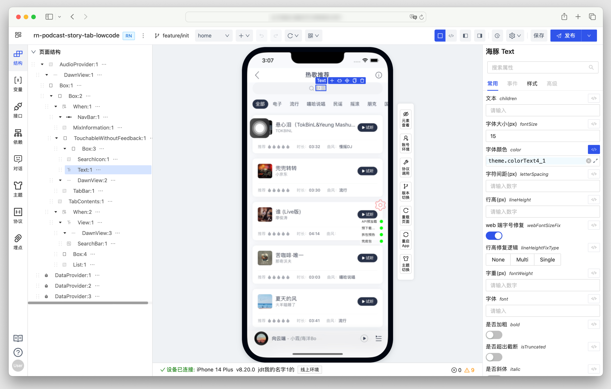
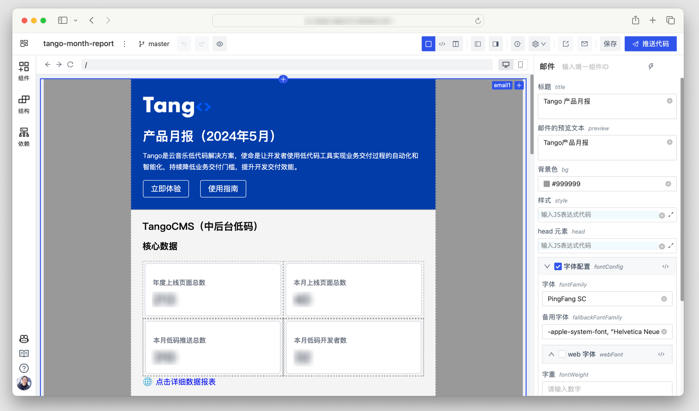

<p align="center">
  
</p>

<h1 align="center">Tango 低代码设计器</h1>
<div align="center">

一个源码驱动的低代码设计器框架

[](https://github.com/NetEase/tango/blob/main/LICENSE)
[](http://npmjs.org/package/@music163/tango-designer)


</div>

简体中文 | [English](/README.md)

## 📄 文档

可以通过下面的链接查看详细的使用指南：

- 官方文档站点: <https://netease.github.io/tango-site/>
- 演示应用: <https://tango-demo.musicfe.com/designer/>

## ✨ 特性

- 经历网易云音乐内网生产环境的实际检验，可灵活集成应用于低代码平台，本地开发工具等
- 提供基于源码 AST 驱动的低代码引擎，无私有 DSL 和协议
- 提供实时出码能力，支持源码进，源码出，适配多种源码开发场景
- 提供开箱即用的前端低代码设计器，提供灵活易用的设计器 React 组件
- 使用 TypeScript 开发，提供完整的类型定义文件和完善的文档支持

## 💡 例子

你可以使用 Tango 快速构建多种类型的基于源码的低代码搭建工具，例如：

| 预览图                                                                                         | 说明                 |
| ---------------------------------------------------------------------------------------------- | -------------------- |
|  | 中后台系统搭建       |
|                                                  | 仪表盘应用搭建       |
|  | H5活动页面搭建       |
|                                                                | ReactNative 应用搭建 |
|                                                            | 营销类邮件搭建       |

## 🌐 兼容环境

- 现代浏览器（Chrome >= 80, Edge >= 80, last 2 safari versions, last 2 firefox versions）

## 💻 开发

### 推荐开发环境

- Node `>= 18`
- Yarn `>= 1.22 && < 2`

### 本地开发调试方法

```bash
# 下载仓库
git clone https://github.com/NetEase/tango.git

# 进入项目根目录
cd tango

# 安装依赖
yarn

# 启动设计器示例
yarn start
```

### 本地 https 证书

如果需要在本地开发环境中使用 https，可以使用以下命令生成证书：

```bash
brew install mkcert

# 将 mkcert 添加到本地根 CA，仅在本地生效
mkcert -install

# 进入 playground 应用目录
cd apps/playground

# 为网站生成一个由 mkcert 签名的证书
mkcert local.netease.com
```

## 💬 社区讨论

参与 NetEase Tango 的社区，以分享您的想法、建议或问题，并与其他用户和贡献者建立联系。

- Discord: <https://discord.gg/B6hkGTe4Rz>
- [使用趋势](https://npm-compare.com/@music163/tango-helpers,@music163/tango-context,@music163/tango-core,@music163/tango-setting-form,@music163/tango-sandbox,@music163/tango-ui,@music163/tango-designer)

## 🤝 参与共建

请先阅读 [贡献指南](https://docs.github.com/en/get-started/quickstart/contributing-to-projects)。

- 克隆仓库
- 创建分支
- 提交代码
- 合并修改 git rebase master
- 发起 Pull Request

## 💗 致谢

感谢网易云音乐公共技术团队，大前端团队，直播技术团队，以及所有参与过 Tango 项目的开发者。

感谢 CodeSandbox 提供的 [Sandpack](https://sandpack.codesandbox.io/) 项目，为 Tango 提供了强大的基于浏览器的代码构建与执行能力。

## 📣 产品推广


不要再浪费时间还原 UI 啦，快来试试网易云音乐「海豹 D2C」研发工具吧！轻松将设计稿转为代码，支持 React、RN、Vue、微信小程序等多端场景，所见即所得！

立即体验「海豹 D2C」：

- 我是 Figma 用户：<https://www.figma.com/community/plugin/1174548852019950797/seal-figma-to-code-d2c/>
- 我是 MasterGo 用户：<https://mastergo.com/community/plugin/98956774428196/>

## 📄 开源协议

此项目遵循 [MIT 开源协议](./LICENSE)
