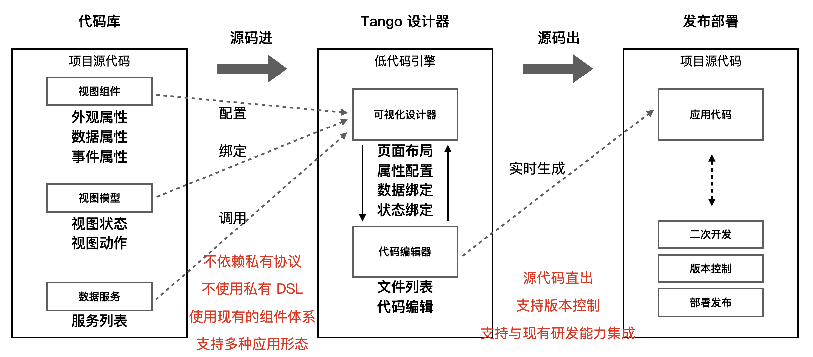

## 📝 Tango 简介

Tango 是一个用于快速构建低代码平台的低代码设计器框架，借助 Tango 只需要数行代码就可以完成一个基本的低代码平台前端系统的搭建。Tango 低代码设计器直接读取前端项目的源代码，并以源代码为中心，执行和渲染前端视图，并为用户提供低代码可视化搭建能力，用户的搭建操作会转为对源代码的修改。借助于 Tango 构建的低代码工具或平台，可以实现 源码进，源码出的效果，无缝与企业内部现有的研发体系进行集成。

### ✨ 核心特性

- 经历网易云音乐内网生产环境的实际检验，可灵活集成应用于低代码平台，本地开发工具等
- 基于源码 AST 驱动，无私有 DSL 和协议
- 提供实时出码能力，支持源码进，源码出
- 开箱即用的前端低代码设计器，提供灵活易用的设计器 React 组件
- 使用 TypeScript 开发，提供完整的类型定义文件

### 🏗️ 基于源码的低代码搭建方案

Tango 低代码引擎不依赖私有搭建协议和 DSL，而是直接使用源代码驱动，引擎内部将源码转为 AST，用户的所有的搭建操作转为对 AST 的遍历和修改，进而将 AST 重新生成为代码，将代码同步给在线沙箱执行。与传统的 [基于 Schema 驱动的低代码方案](https://mp.weixin.qq.com/s/yqYey76qLGYPfDtpGkVFfA) 相比，不受私有 DSL 和协议的限制，能够完美的实现低代码搭建与源码开发的无缝集成。

### 📄 源码进，源码出

由于引擎内核完全基于源代码驱动实现，Tango 低代码引擎能够实现源代码进，源代码出的可视化搭建能力，不提供任何私有的中间产物。如果公司内部已经有了一套完善的研发体系（代码托管、构建、部署、CDN），那么可以直接使用 Tango 低代码引擎与现有的服务集成构建低代码开发平台。

### 🏆 产品优势

与基于私有 Schema 的低代码搭建方案相比，Tango 低代码引擎具有如下优势：

| 对比项       | 基于 Schema 的低代码搭建方案                       | Tango（基于源码 AST 转换）                                            |
| ------------ | -------------------------------------------------- | --------------------------------------------------------------------- |
| 适用场景     | 面向特定的垂直搭建场景，例如表单，营销页面等       | 🔥 面面向以源码为中心的应用搭建场景                                   |
| 语言能力     | 依赖私有协议扩展，不灵活，且难以与编程语言能力对齐 | 🔥 直接基于 JavaScript 语言，可以使用所有的语言特性，不存在扩展性问题 |
| 开发能力     | LowCode                                            | 🔥 LowCode + ProCode                                                  |
| 源码导出     | 以 Schema 为中心，单向出码，不可逆                                   | 🔥 以源码为中心，双向转码                                             |
| 自定义依赖   | 需要根据私有协议扩展封装，定制成本高               | 🔥 原有组件可以无缝低成本接入                                         |
| 集成研发设施 | 定制成本高，需要额外定制                           | 🔥 低成本接入，可以直接复用原有的部署发布能力                         |

## 📐 技术架构

Tango 低代码引擎在实现上进行了分层解藕，使得上层的低代码平台与底层的低代码引擎可以独立开发和维护，快速集成部署。此外，Tango 低代码引擎定义了一套开放的物料生态体系，开发者可以自由的贡献扩展组件配置能力的属性设置器，以及扩展低代码物料的二方三方业务组件。

具体的技术架构如下图所示：

## ⏰ 开源里程碑

Tango 低代码引擎是网易云音乐内部低代码平台的核心构件，开源涉及到大量的核心逻辑解藕的工作，这将给我们正常的工作带来大量的额外工作，因此我们计划分阶段推进 Tango 低代码引擎的开源事项。

1. 今天我们正式发布 Tango 低代码引擎的第一个社区版本，该版本将会包括 Tango 低代码引擎的核心代码库，TangoBoot 应用框架，以及基于 antd v4 适配的低代码组件库。
2. 我们计划在今年的 **9 月 30 日** 发布低代码引擎的 **1.0 Beta** 版本，该版本将会对核心的实现面向社区场景重构，移除掉我们在云音乐内部的一些兼容代码，并将核心的实现进行重构和优化。
3. 我们计划在今年的 **10 月 30 日** 发布低代码引擎的 **1.0 RC** 版本，该版本将会保证核心 API 基本稳定，不再发生 BREAKING CHANGE，同时我们将会提供完善翔实的开发指南、部署文档、和演示应用。
4. **正式版**本我们将在 **2023 年 Q4 结束前** 发布，届时我们会进一步完善我们的开源社区运营机制。

## 🤝 社区建设

我们的开源工作正在积极推进中，可以通过如下的信息了解到我们的最新进展：

- Github 仓库：<https://github.com/NetEase/tango>
- 文档站点：<https://netease.github.io/tango/>

欢迎大家加入到我们的社区中来，一起参与到 Tango 低代码引擎的开源建设中来。有任何问题都可以通过 [Github Issues](https://github.com/NetEase/tango/issues) 反馈给我们，我们会及时跟进处理。

## 💗 致谢

感谢网易云音乐公共技术团队，大前端团队，直播技术团队，以及所有参与过 Tango 项目的同学们。

感谢 CodeSandbox 提供的 [Sandpack](https://sandpack.codesandbox.io/) 项目，为 Tango 提供了强大的基于浏览器的代码构建与执行能力。
