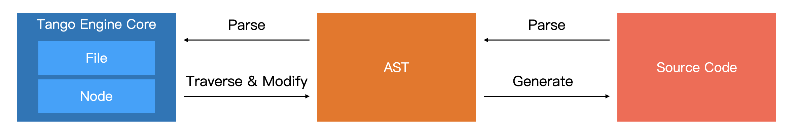

## 📝 Introduction

Tango is a low-code builder framework for quickly building low-code platforms or tools. With Tango, you only need a few lines of code to build a basic low-code builder. The Tango low-code builder reads the source code of the frontend project directly, executes and renders the frontend view based on the source code, and provides users with low-code visual building capabilities. User's building operations will be translated into modifications to the source code. With low-code tools or platforms built using Tango, it is possible to achieve the effect of "source code in, source code out" and seamlessly integrate with the existing development flow within the enterprise.

### ✨ Features

- After actual testing in the production environment of NetEase Cloud Music, it can be flexibly integrated and applied to low-code platforms, local development tools, and more.
- Driven by source code AST, with no private DSL and protocols.
- Provides real-time code output capability, supports source code input and output.
- Out-of-the-box front-end low-code designer, providing flexible and easy-to-use designer React components.
- Developed using TypeScript, providing complete type definition files.

### 🏗️ Code-based Low-Code Solution

Due to the fact that the engine kernel is completely based on the source code-driven implementation, Tango low-code engine can achieve the visualization building capability of source code input and source code output, without providing any private intermediate products. If the company already has a complete R&D system (code hosting, building, deployment, CDN), Tango low-code engine can be directly used to integrate with existing services to build a low-code development platform.

### 📄 Code in, Code out

Due to the engine kernel being completely driven by source code, the Tango low-code engine can achieve the visual construction capability of source code in and source code out, without providing any private intermediate products. If the company already has a complete development system (code hosting, building, deployment, CDN), then it can directly use the Tango low-code engine to integrate with existing services to build a low-code development platform.

### 🏆 Advantages

Compared to the low-code building solution based on private schema, Tango low-code engine has the following advantages:

| Comparison Items          | Schema-base low-code solution                                                                                        | Tango (Code-based)                                                                               |
| ------------------------- | -------------------------------------------------------------------------------------------------------------------- | ------------------------------------------------------------------------------------------------ |
| Applicable Scenarios      | Targeted vertical building scenarios, such as forms, marketing pages, etc.                                           | 🔥 Applicable to application building scenarios centered on source code                          |
| Language Capabilities     | Relies on private protocols for extension, inflexible, and difficult to align with programming language capabilities | 🔥 Based directly on JavaScript language, can use all language features, no extensibility issues |
| Development Capability    | LowCode                                                                                                              | 🔥 LowCode + ProCode                                                                             |
| Source Code Export        | Centered on schema, one-way code output, irreversible                                                                | 🔥 Source code-centered, two-way transcoding                                                     |
| Custom Dependencies       | Need to be encapsulated according to private protocol extension, high customization cost                             | 🔥 Existing components can be seamlessly and low-cost integrated                                 |
| Integrated R&D Facilities | High customization cost, additional customization required                                                           | 🔥 Low-cost integration, can directly reuse existing deployment and publishing capabilities      |

The specific technical architecture is shown in the following figure:

## 📐 Architecture

The Tango low-code engine has been layered and decoupled in implementation, enabling independent development and maintenance of the upper-level low-code platform and the lower-level low-code engine, allowing for fast integration and deployment. In addition, Tango's low-code engine defines an open material ecosystem, allowing developers to freely contribute to extension components and configure property setters that enhance low-code materials.

The specific technical architecture is shown in the following diagram.

## ⏰ Milestones

Tango low-code engine is the core component of NetEase Cloud Music's internal low-code platform. Open sourcing involves a lot of decoupling work of core logic, which will bring us a lot of additional work in our normal work. Therefore, we plan to promote the open source of Tango low-code engine in stages.

1. Today we officially released the first community version of Tango low-code engine, which will include the core code library of Tango low-code engine, TangoBoot application framework, and low-code component library adapted to antd v4.
2. We plan to release the 1.0 Beta version of the low-code engine on September 30th this year. This version will refactor the core implementation for community scenarios, remove some compatibility code we have internally in Cloud Music, and optimize the implementation of the core.
3. We plan to release the 1.0 RC version of the low-code engine on October 30th this year. This version will ensure that the core API is basically stable and no longer has BREAKING CHANGE. At the same time, we will provide comprehensive and detailed development guides, deployment documents, and demonstration applications.
4. The official version will be released before the end of Q4 2023, and we will further improve our open source community operation mechanism.

## 🤝 Community

Our open source work is actively advancing, and you can learn about our latest progress through the following information:

- Github Repository: <https://github.com/NetEase/tango>
- Documentation Site: <https://netease.github.io/tango/>

Welcome everyone to join our community and participate in the open source construction of the Tango low-code engine. Any questions can be reported to us through [Github Issues](https://github.com/NetEase/tango/issues), and we will follow up and deal with them promptly.

## 💗 Acknowledgements

Thanks to the Netease Cloud Music Public Technical Team, the Front-End Team, the Live Broadcasting Technical Team, and all the colleagues who participated in the Tango project.

Thanks to the Sandpack project provided by CodeSandbox, which provides powerful browser-based code building and execution capabilities for Tango.

Tanks to the Babel project, which provides powerful javascript ast parsing and traversing capabilities for Tango.
